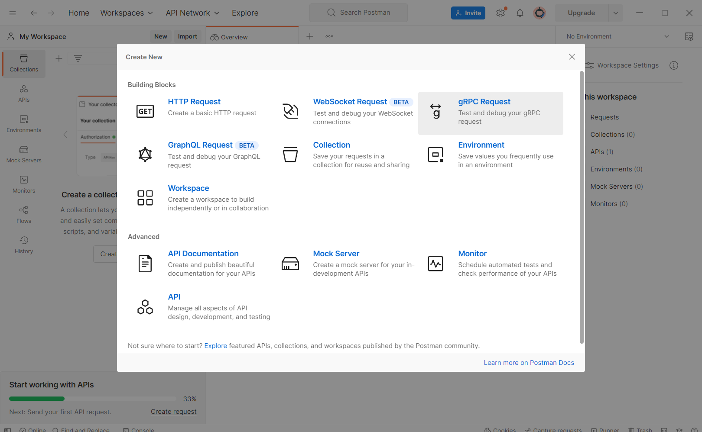
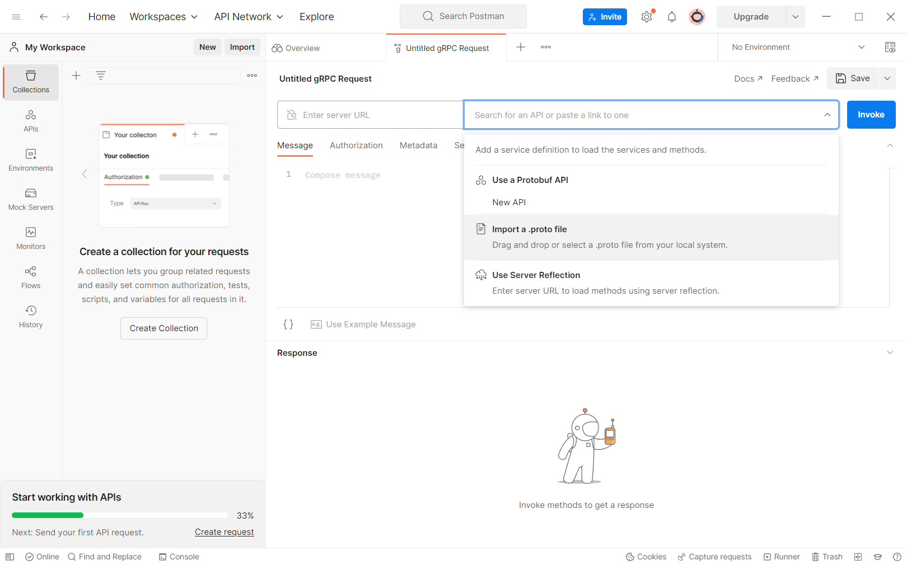
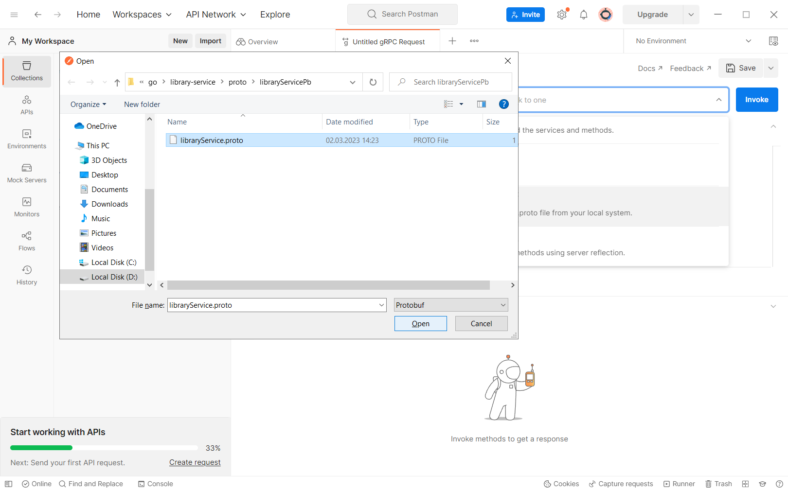
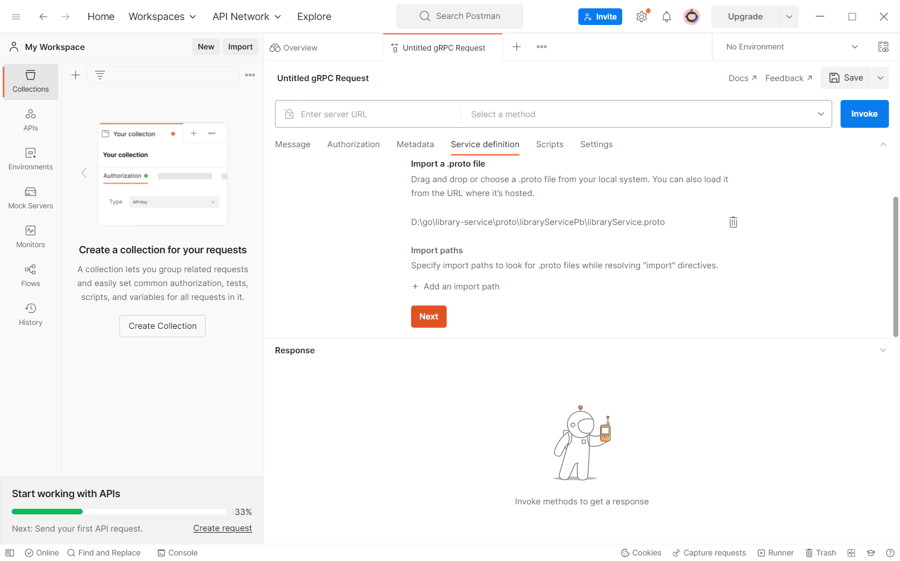
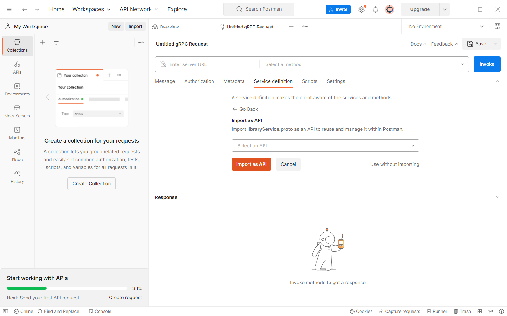
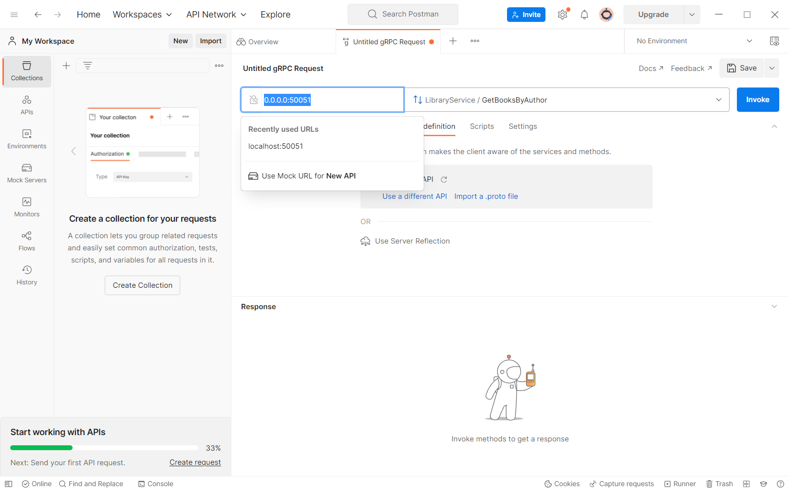
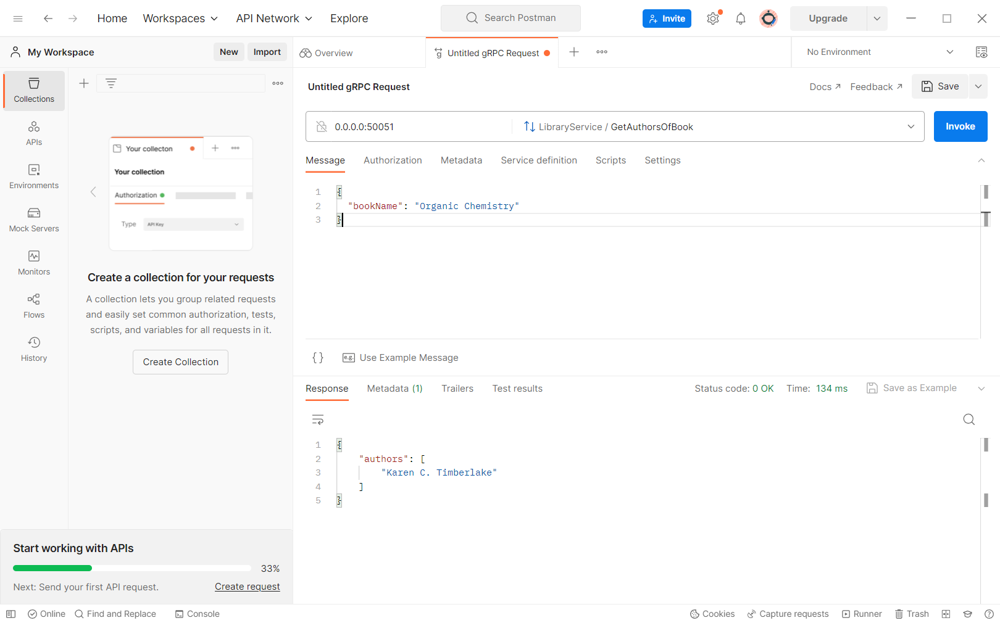
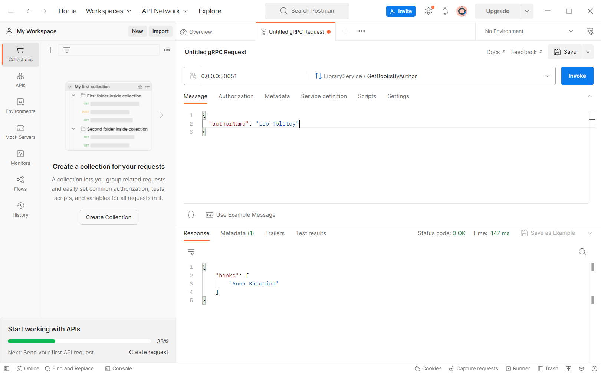

### Library Serivce
Данный сервис предоставляет доступ к данным по книгам и их авторов из базы данных MySQL при помощи gRPC.  
Сервис запускается по умолчанию на localhost:50051, если не указано иначе в configs/config.yaml.  
База данных запускается из докера. Сначала создается образ из dockerfile, а потом разворачивается контейнер отдельной командой.  
Есть два метода gRPC: GetAuthorsOfBook (возвращает список авторов книги) и GetBooksByAuthor (возвращает список книг автора).  
Файлы .proto находятся в proto/libraryServicePb.  
Стек проекта: Go, gRPC, MySQL, Docker.  
### "Ассортимент" библиотеки
В библиотеке есть:
- "Philosopher's Stone" by J.K. Rowling
- "Chamber of Secrets" by J.K. Rowling
- "Prisoner of Azkaban" by J.K. Rowling
- "Goblet of Fire" by J.K. Rowling
- "Order of the Phoenix" by J.K. Rowling
- "Half-Blood Prince" by J.K. Rowling
- "Deathly Hallows" by J.K. Rowling
- "Chemistry" by Karen C. Timberlake, William Timberlake
- "Advanced Chemistry" by Karen C. Timberlake, William Timberlake
- "Organic Chemistry" by Karen C. Timberlake
- "Anna Karenina" by Leo Tolstoy
## Как запустить сервис на своем компьютере
1. Первым делом нужно скопировать гит репозиторий в подходящию для вас папку.
```
git clone https://github.com/rogudator/library-service.git
```
2. Перейти в папку сервиса.
```
cd library-service
```
3. Для безопасности пароль от базы данных хранится в переменной окружения. db.env можно создать вот так:

UNIX/MAC: 
```
echo 'MYSQL_PASSWORD=securepassword'>db.env
```
Windows:
```
echo MYSQL_PASSWORD=securepassword>db.env
```
4. Теперь нужно сбилдить образ MySQL.
```
make build-db
```
5. После этого можно запустить контейнер базы данных.
```
make db
```
6. Загрузить зависимости. (Если возникнут проблемы на данном этапе, попробовать ```go mod tidy```)
```
go mod download
```
7. Запустить проект локально.
```
make local
```

### Пример того, как можно сделать запрос через gRPC в сервис из Postman
1. Нажав на New, нужно выбрать gRPC request.

2. Нужно импортировать .proto файл с методами.

3. Выбрать файл по адресу library-service\proto\libraryServicePb\libraryService.proto

4. Нажать Next.

5. Нажать на Import API.

6. В качестве хоста лучше использовать ```0.0.0.0:50051``` , если не указывали иначе.

7. Нужно нажать на вкладку message под полем, где вводили хост.Ниже пример запроса GetAuthorsOfBook

Текст сообщения:
```
{
  "bookName": "Organic Chemistry"
}
```
8. Пример запроса GetBooksByAuthor

Текст сообщения:
```
{
  "authorName": "Leo Tolstoy"
}
```
